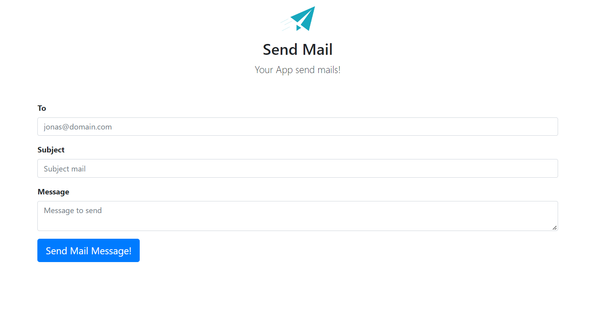
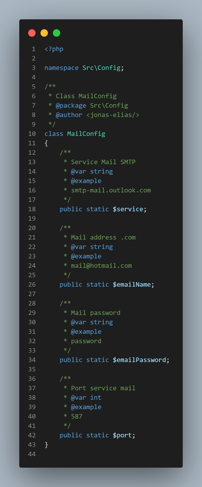

# app-send-mail

This project is a simple application to send mails with <strong>PHP</strong>. The configuration, was made via protocol <strong>SMTP</strong> of the <strong>OUTLOOK</strong> and the mail is sent with the help of the <strong>PHPMailer</strong> library.

<hr>



<hr>

## Requirements
    PHP 8.0+
    PHP Mailer
    Account in the OUTLOOK

## Installation

Clone the repository:
```bash
$ git clone https://github.com/jonas-elias/app-send-mail.git
```

Access the folder:
```bash
$ cd app-send-mail/public 
```
Run server:
```bash
$ php -S localhost:8080
```

## Configuration

In file /Config/Mail.php, you can configure the mail with your account in the OUTLOOK.

<div align="center">
    
</div>

<hr>

## License
```bash
MIT License - <jonas-elias/>
```
